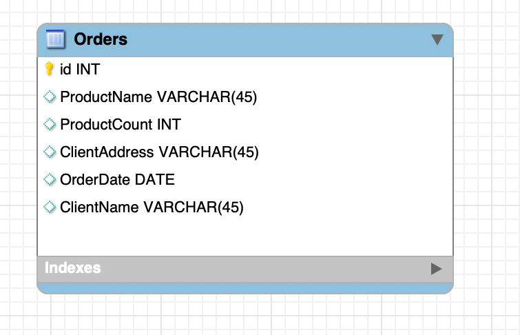

# Завдання 1

Переведіть початкову таблицю в першу нормальну форму.

## Відповідь

Вигляд таблиці після переведення в першу нормальну форму:

| Номер_замовлення | Назва_товару | Кількість товару | Адреса_клієнта | Дата_замовлення | Клієнт   |
|------------------|--------------|------------------|----------------|-----------------|----------|
| 101              | Лептоп       | 3                | Хрещатик 1     | 2023-03-15      | Мельник  |
| 101              | Мишка        | 2                | Хрещатик 1     | 2023-03-15      | Мельник  |
| 102              | Принтер      | 1                | Басейна 2      | 2023-03-16      | Шевченко |
| 103              | Мишка        | 4                | Комп'ютерна 3  | 2023-03-17      | Коваленко|

## Діаграма

Файл моделі доступний за [посиланням](./hw2_1.mwb).
