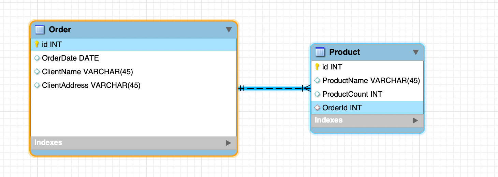

# Завдання 2

Переведіть нові таблиці в другу нормальну форму.

## Відповідь

Вигляд таблиць після переведення в другу нормальну форму:

### Таблиця `Замовлення`

| Номер_замовлення | Адреса_клієнта | Дата_замовлення | Клієнт   |
|------------------|----------------|-----------------|----------|
| 101              | Хрещатик 1     | 2023-03-15      | Мельник  |
| 102              | Басейна 2      | 2023-03-16      | Шевченко |
| 103              | Комп'ютерна 3  | 2023-03-17      | Коваленко|

### Таблиця `Товари`

| Назва_товару | Кількість | Номер_замовлення |
|--------------|-----------|------------------|
| Лептоп       | 3         | 101              |
| Мишка        | 2         | 101              |
| Принтер      | 1         | 102              |
| Мишка        | 4         | 103              |

## Діаграма

Файл моделі доступний за [посиланням](./hw2_2.mwb).
