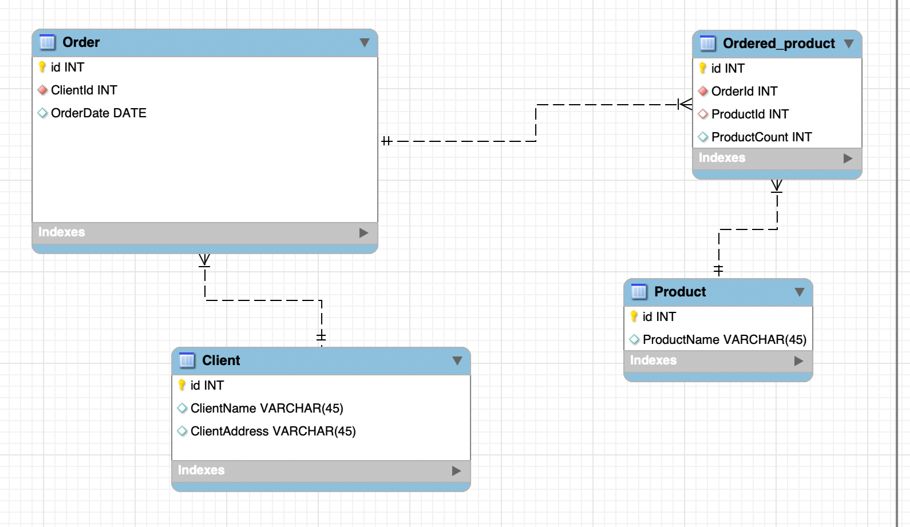

# Завдання 3

Переведіть нові таблиці в третю нормальну форму.

## Відповідь

Вигляд таблиць після переведення в третю нормальну форму:

### Таблиця `Замовлення`

| Номер_замовлення | Дата_замовлення | Клієнт ID  |
|------------------|-----------------|------------|
| 101              | 2023-03-15      | 1          |
| 102              | 2023-03-16      | 2          |
| 103              | 2023-03-17      | 3          |

### Таблиця `Клієнти`

| Клієнт ID | Адреса_клієнта | Клієнт   |
|-----------|----------------|----------|
| 1         | Хрещатик 1     | Мельник  |
| 2         | Басейна 2      | Шевченко |
| 3         | Комп'ютерна 3  | Коваленко|

### Таблиця `Замовлені товари`

| ID | Номер_замовлення | Товар ID | Кількість |
|----|------------------|----------|-----------|
| 1  | 101              | 1        | 3         |
| 2  | 101              | 2        | 2         |
| 3  | 102              | 3        | 1         |
| 4  | 103              | 2        | 4         |

### Таблиця `Товари`

| Товар ID | Назва_товару |
|----------|--------------|
| 1        | Лептоп       |
| 2        | Мишка        |
| 3        | Принтер      |

## Діаграма

Файл моделі доступний за [посиланням](./hw2_3.mwb).
